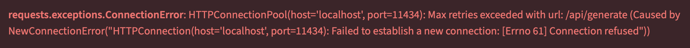

# Yelp RAG: Restaurant Review Summarization

An end-to-end **retrieval-augmented generation (RAG)** system that summarizes restaurant reviews by topic (**food, service, ambiance**) using semantic search and a local LLM.

The project is built as a **production-style ML system**, not a notebook demo: data processing, retrieval, summarization, and UI are cleanly separated and fully reproducible.

---

### What This Project Demonstrates

- Practical RAG architecture without managed vector databases  
- Local semantic search using FAISS
- Topic-aware retrieval to reduce LLM hallucination  
- Config-driven, testable Python pipeline  
- Local LLM inference with Ollama 
- Lightweight Streamlit dashboard for exploration  

---

### High-Level Flow
```
Raw reviews
   → cleaning & chunking
   → embeddings via HuggingFace
   → FAISS indices on a per-restaurant basis
   → topic-based retrieval
   → LLM summarization using Ollama
   → parquet summaries
   → Streamlit dashboard
```

### Repo Structure
```
yelp_rag/
├── app.py                  # Streamlit dashboard
├── run_pipeline.py         # Pipeline entry point
├── src/
│   ├── config.py           # Central configuration
│   ├── cleaning.py         # Review cleaning & chunking
│   ├── embeddings.py       # Embedding generation
│   ├── retrieval.py        # FAISS similarity search
│   ├── summarization.py    # LLM prompts + Ollama calls
│   ├── data_io.py          # Parquet & filesystem utilities
│   ├── emit_util.py        # Pipeline status emission
│   └── __init__.py
```

**Note:** pipeline-generated artifacts (FAISS indices, metadata, summaries) are intentionally excluded from version control and 
are rebuilt by the pipeline for each execution.

---

### Running a Local Instance of This Project

#### 1. Clone the Repo
```
git clone https://github.com/jtolsma1/yelp_rag.git
```

#### 2. Download Yelp Open Dataset
**2a.** The JSON dataset is available to download at https://business.yelp.com/data/resources/open-dataset/
(total file size is multiple GB)<br><br>
**2b.** Unzip the downloaded file<br><br>
**2c.** Within the cloned repo, create a folder called `data/raw`<br><br>
**2d.** Place these JSON files in `data/raw`:<br>
```
yelp_academic_dataset_business.json
yelp_academic_dataset_review.json
```

#### 3. Install requirements
Create a new virtual environment if desired (not shown), then
execute these commands in terminal to install dependencies:
```
cd /local/path/to/repo/yelp_rag/

pip install -r requirements.txt
```

#### 4. Run Ollama

**4a.** Install Ollama on local setup from https://ollama.com/download.<br><br>
**4b.** In terminal, download an LLM to run locally (will likely require multiple GB of free disk space); for example:<br>
```
ollama pull llama3.1:8b
```
Please refer to https://ollama.com/search for the list of models available for download.<br><br>
**4c**. In `src/config.py` in this repo, input the name of the downloaded Ollama model into the `OLLAMA_MODEL` parameter.<br><br>
**4d (optional).** Configure other LLM parameters in `src/config.py`, such as the Ollama URL and temperature, if necessary.<br><br>
**4e.** Run Ollama on local setup; expect to see this UI upon opening, although the UI is not needed to run the code in this repo:<br><br>
</img>

#### 5. Run the Dashboard
In the terminal, run:
```
streamlit run app.py
```

---

### Troubleshooting Notes
To execute end-to-end, the RAG pipeline needs both:
- **a working internet connection, and**
- **Ollama running in the background**

If either condition is not met, the script will fail and throw an HTTP connection error:<br><br>
</img>

To resolve, ensure that the local environment is connected to the internet, then start or restart Ollama.

---

### Why I Made This Project
* To teach myself vector search, LLM summarization, and Streamlit
* To practice productionizing ML pipelines
